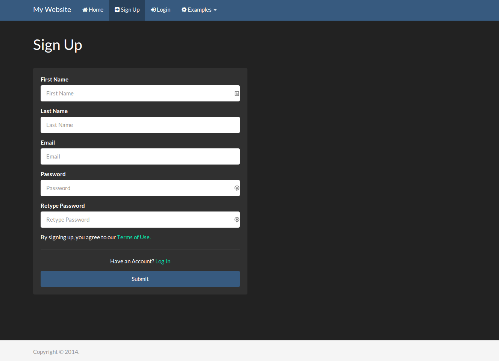
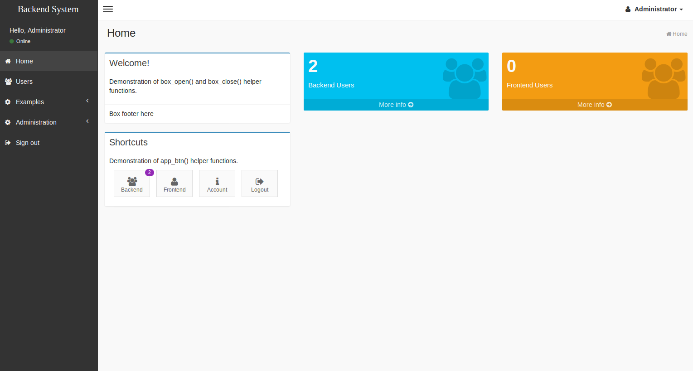

## CodeIgniter Bootstrap


### IMPORTANT NOTE

As CodeIgniter has announced [version 3](http://forum.codeigniter.com/thread-1657.html) (full changelog [here](http://www.codeigniter.com/userguide3/changelog.html)) recently and it introduces some major changes in folder structure, I am taking this chance to further enhance my code and make use of new features from the new CI, therefore I will be moving to new repository for next version of CI Bootstrap. 

Please stay tuned to **ci_bootstrap_3** which is work-in-progress at this moment:
https://github.com/waifung0207/ci_bootstrap_3

This repository will be slowly depreciated and updated only when CodeIgniter 2 release securify fix. 


### Introduction

A starter template that supports multi-tenant (frontend / backend) website in a single application.

This repository is developed upon the following tools: 
* [CodeIgniter](http://www.codeigniter.com/) (v2.2.2) - PHP framework
* [Bootstrap](http://getbootstrap.com/) (v3.3.4) - popular frontend framework
* [Bootswatch](http://bootswatch.com/) (v3.3.4) - theme options capatible to Bootstrap framework
* [Grocery CRUD](http://www.grocerycrud.com/) (v1.5.1) - feature-rich library to build CRUD tables
* [Image CRUD](http://www.grocerycrud.com/image-crud) (v0.6) - CRUD library for image management
* [AdminLTE](https://github.com/almasaeed2010/AdminLTE) (v2.0.5) - bootstrap theme for backend system
* [codeigniter-base-model](https://github.com/jamierumbelow/codeigniter-base-model) - MY_Model implementation for easier database handling 

Please note this project will change from time to time (breaking changes is unavoidable among commits by now), but should works fine at production (at least in my personal jobs). 


### Features

This repository contains setup for rapid development:
* Multi-tenant (frontend / backend) website in single application
* Backend site in AdminLTE v2 theme
* Backend site with Grocery CRUD integration
* Backend site with authenication and backend user management
* Frontend site with basic membership system (sign up, activate, login, forgot password, etc.)
* Preset layouts and templates
* Preset asset pipeline (e.g. minify scripts, image optimization) via Gulp
* Preset MY_Controller and MY_Model classes
* Menu config from single file
* Breadcrumb handling
* Custom 404 error page
* Preset email layout template
* Helper classes for enhanced code reuse (see the **Helpers** section)
* Multilingual support (frontend)


### Server Requirements (Preferred)

* **PHP 5.5+** (mainly for [password_hash()](http://php.net/manual/en/function.password-hash.php) and [password_verify()](http://php.net/manual/en/function.password-verify.php) functions as used from auth_helper); otherwise see [issue #2](https://github.com/waifung0207/ci_bootstrap/issues/2) for alternative method but minimum PHP version will still be **5.4+**, due to my usage of [shortcut syntax](http://php.net/manual/en/migration54.new-features.php) throughout the repository
* **Apache 2.2+** with rewrite mod enabled
* **MySQL 5.5+**


### Setup Procedure

1. Git clone this repository to a LAMP / WAMP server
2. In prior to use both frontend & backend system, create a MySQL database (e.g. named "ci_bootstrap"), then import data from sql/ci_bootstrap.sql
3. Update database config file (e.g. under applications/backend/config)
4. Frontend Website can be visited via link like: http://localhost/ci_bootstrap/
5. Backend System can be visited via link like: http://localhost/ci_bootstrap/backend.php; and login as **admin**/**admin** or **staff**/**staff**
6. That's it! You should see a fancy membership-enabled frontend, as well as an AdminLTE dashboard from backend


### Helpers

Some useful helpers are created for better code reuse throught the project; any of them can be easily edited depends on your own use. 

* **alert_helper**: to handle form message (e.g. success/error) in a easy way
* **auth_helper**: to handle user authentication
* **MY_email_helper**: to handle email sending operations
* **MY_form_helper**: to shorten CodeIgniter's form validation; and functions to generate common form elements
* **MY_html_helper**: to generate AdminLTE widgets
* **MY_url_helper**: shortcut functions to reach assets


### Asset Customization (e.g. additional js/css files)

A gulp file (**gulpfile.js**) is prepared for asset pipeline. To make use of it, you need to pre-install the following tools before building the template:

* [node.js](http://nodejs.org/): which includes a package manager (npm) for node modules
* [bower](http://bower.io/): package manager for bower components (to handle third-party assets)
* [gulp](http://gulpjs.com/): task runner for lots of purposes, e.g. compile, combine and minify scripts

Afterwards, change directory from your terminal to where you cloned the repository.

1. Update **bower.json** then call bower to download third-party packages: ```bower install```
2. Update **package.json** then install gulp packages: ```npm install```
3. Update **gulpfile.js** (which is written in CoffeeScript), then use gulp command to start preset tasks: ```gulp```
4. After all you will find the post-processed files under the **"assets/dist"** folder, means you have successfully configured it :)


### Screenshots

Frontend - Sign Up: 



Backend - Home: 



**Note**: Current screenshots for Backend System is outdated since the repo has upgraded to latest AdminLTE v2 already.

More screenshots can be viewed from the [screenshots folder](https://github.com/waifung0207/ci_bootstrap/blob/master/screenshots/) under this repository.


### Changelog

Project changelog is recorded down in the [CHANGELOG file](https://github.com/waifung0207/ci_bootstrap/blob/master/CHANGELOG.md).


### TODO

* Update screenshots
* Enhance Gulpfile (e.g. Browser Sync, Sass)
* Add example of using Image CRUD
* Caching setup
* More helpers to enhance code reusability
* Better documentation
* API site
